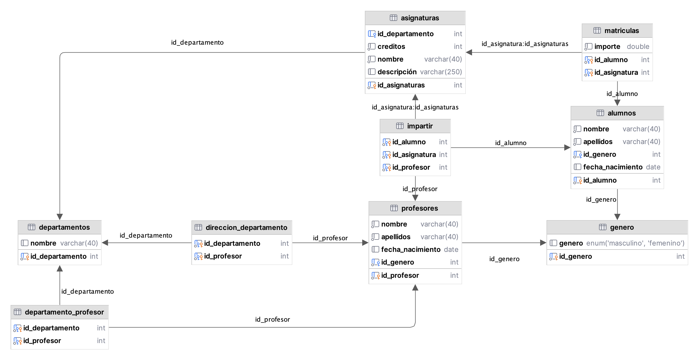

# Actividad 4 - Bases de datos

## INTRODUCCIÓN

La gestión de bases de datos en SQL es un componente fundamental en el ámbito de la Ingeniería Informática. En este trabajo, se ha abordado el diseño y la implementación de un sistema de bases de datos utilizando el enfoque del diagrama Entidad-Relación y su transformación en tablas relacionales. El objetivo principal ha sido aplicar los conocimientos adquiridos en esta área mediante el desarrollo de un ejemplo concreto.

El proceso se ha llevado a cabo siguiendo un orden estructurado. En primer lugar, se diseñó el diagrama Entidad-Relación, que permite representar las entidades, atributos y relaciones presentes en el dominio de la base de datos. Se ha puesto especial énfasis en comprender y aplicar las cardinalidades, tanto para establecer las relaciones fuertes como para identificar las relaciones débiles.

A continuación, se procedió a la transformación del diagrama Entidad-Relación en un modelo relacional mediante un script SQL. Este proceso implica la creación de tablas que reflejen adecuadamente la estructura y las restricciones de la base de datos, garantizando la integridad y consistencia de los datos.

Posteriormente, se redactó otro script SQL para la inserción de los datos correspondientes a los listados mencionados en el enunciado. Esta fase es crucial para poblar la base de datos y permitir la realización de consultas y análisis posteriores.

A lo largo de este trabajo, se ha puesto de manifiesto la importancia de la correcta gestión de bases de datos y la aplicación de los conceptos teóricos aprendidos. El enfoque del diagrama Entidad-Relación ha demostrado ser una herramienta valiosa para el diseño y la implementación de sistemas de bases de datos robustos y eficientes.


## DISEÑO DEL DIAGRAMA ENTIDAD-RELACIÓN

En este apartado especificaremos los pasos seguidos para la realización del diagrama Entidad-Relación.


### Captura de requisitos

Lo primero que realizamos fue un correcto análisis de los requisitos mostrados en el enunciado para diseñar una base de datos para la gestión académica de una academia, en la que se nos solicitaba la creación de una base de datos relacional que mantuviera los datos de alumnos y profesores. No obstante, se decide desarrollar una base de datos más amplia para integrar departamentos y matriculaciones.


### Diseño conceptual

En segundo lugar, se capturaron todos los elementos necesarios para representar la estructura lógica de la base de datos, mostrando las entidades, sus atributos, las relaciones entre ellas y las restricciones que rigen dichas relaciones. 


#### Entidades

- Alumnos
- Profesores
- Asignaturas
- Departamentos

 

#### Atributos

- **alumno**s:
  - *id_alumno* PK
  - id_genero FK de `genero.id_genero`
  - nombre.
  - apellidos
  - fecha_nacimiento

- **profesores**:

  - *id_alumno* PK

  - id_genero FK de `genero.id_genero`
  - nombre.
  - apellidos
  - fecha_nacimiento 

- **asignaturas**:
  - *id_asignatura* PK
  - id_departamento FK de `departamento.id_departamento`
  - nombre.
  - descripcion.

- **departamento**:
  - *id_departamento* PK
  - nombre.

- **genero**:
  - *id_genero* PK
  - genero.

 

### **Relaciones**

- matricularse → matriculas 
- impartir → impartir
- dirigir → direccion_departamento 
- pertenecer → departamento_profesor

 

### **Relaciones entre tablas**

- alumno → matricularse → asignatura
- alumno → impartir → asignatura
- profesor → impartir → asignatura
- profesor → dirige → departamento
- profesor → pertenece → departamento

 

### **Cardinalidades**

Las cardinalidades nos indican la cantidad de instancias de una entidad que pueden estar relacionadas con instancias de otra entidad a través de una relación. Las cardinalidades se representan mediante símbolos o números cerca de las líneas de relación.

Las cardinalidades las representaremos en el diagrama Entidad-Relación.


<center><i>Diagrama Entidad-Relación</i></center>


## **Diseño lógico**

En este apartado convertiremos nuestro esquema conceptual en un esquema lógico, en el que representaremos las tablas, la estructuración de datos y el modelado de restricciones disponibles.




<center><i>Esquema lógico</i></center>


## **Diseño físico**

Una vez definido el esquema lógico, en este apartado especificaremos los pasos seguidos para la creación de la base de datos, la creación de las tablas y la inserción de los datos a nuestra BD.

 

1. **Creación de la base de datos**: Para crear una base de datos, se utiliza el comando `CREATE DATABASE` en SQL. Por ejemplo, para crear nuestra base de datos llamada "academia", debemos escribir:

   ```sql
   CREATE DATABASE academia;
   ```

    

2. **Creación de tablas**: Para crear una tabla, se utiliza el comando `CREATE TABLE` en SQL. El siguiente es un ejemplo de cómo crear la tabla llamada "*alumno*s".

   ```sql
   CREATE TABLE alumnos (
     id_alumno int(11) NOT NULL,
     nombre varchar(40) NOT NULL,
     apellidos varchar(40) NOT NULL,
     id_genero int(11) NOT NULL,
     fecha_nacimiento date DEFAULT NULL
   )
   ```

    

3. **Creación de relaciones entre tablas**: Si necesitamos crear relaciones entre tablas, debemos agregar campos de clave externa. En el siguiente ejemplo, relacionamos la tabla “matriculas” con la tabla “alumnos” y la tabla "profesores".

   ```sql
   ALTER TABLE matriculas
   add constraint matriculas_alumnos_id_alumno_fk
           foreign key (id_alumno) references alumnos (id_alumno),
       constraint matriculas_asignaturas_id_asignaturas_fk
           foreign key (id_asignatura) references asignaturas (id_asignaturas)
   ```

    

4. **Inserción de datos**: Para insertar datos en una tabla, se utiliza el comando `INSERT INTO`. El siguiente es un ejemplo de cómo insertar los nuevos registros en la tabla "*alumno*s".

   ```sql
   insert into academia.alumnos (id_alumno, nombre, apellidos, id_genero, fecha_nacimiento)
   values  (1, 'Juan', 'Perez Valgañon', 1, '1980-02-07'),
           (2, 'Miguel', 'Perez García', 1, '1983-01-18'),
           (3, 'Susana', 'Perez Saenz', 2, '1990-03-30'),
           (4, 'Carmen', 'Puente Mancebo', 2, '1960-09-15'),
           (5, 'Alberto', 'de la Serna Parada', 1, '1984-03-27'),
           (6, 'Jose Manuel', 'Pinillos Rubio', 1, '1656-04-15'),
           (7, 'Pedro', 'Matias Jadraque', 1, '1985-08-27'),
           (8, 'Felisa', 'Viguera Moreno', 2, '1988-12-08'),
           (9, 'Javier', 'Jimenez Jimenez', 1, '1991-07-29'),
           (10, 'Alina', 'Sanz Segura', 2, '1981-02-22');
   ```

    

Al introducir los datos en una tabla debemos tener en cuenta varios factores:

- Hay tablas que deberán contener datos antes que otras para que no se violen algunas de las restricciones (como las de clave externa).
- El orden en que escribimos los atributos debe ser el mismo en el que están dispuestos en las tablas. Si queremos introducirlo en distinto orden, deberemos indicarlo expresamente en la consulta.
- Debemos tener en cuenta las restricciones de cada uno de nuestros atributos.


## TÉCNICAS UTILIZADAS

A continuación, se realizará una breve explicación de las relaciones entre las entidades descritas en el diagrama entidad-relación.


### Relación "dirigir" entre "profesores" y "departamentos"

En esta relación, cada profesor dirige exactamente un departamento, y cada departamento es dirigido exactamente por un profesor, lo que implica una relación **1:1**. En un principio se tomó la decisión de propagar la clave en algún sentido, pero nos encontrábamos con un problema a la hora de realizar el resto de las relaciones y otro a la hora de crear las tablas con las claves primarias, con lo que optamos por crear una nueva tabla **(direccion_departamento)**.

El enlace entre estas entidades se hace a través de las claves **'id_profesor'** e **'id_departamento'**. Se generan las claves foráneas (FK) en la tabla **'direccion_departamento'** que se relaciona con las claves primarias (PK) de las entidades "**profesores**" y "**departamentos**".

 

### Relación "pertenecer" entre "profesores" y "departamentos"

Aquí, un profesor puede pertenecer a uno o varios departamentos y un departamento puede tener uno o varios profesores, lo que implica una relación **M:N**., por tanto, se crea una nueva tabla (**departamento_profesor**). El enlace entre estas entidades se realiza a través de las claves **'id_profesor'** e **'id_departamento'**.

Se generan las claves foráneas (FK) en la tabla **'departamento_profesor'** que se relaciona con las claves primarias (PK) de las entidades "**profesores**" y "**departamentos**". 

 

### Relación "matricularse" entre "alumno" y "asignatura"

En este caso, un estudiante puede estar matriculado en 0 o varias asignaturas, y una asignatura puede ser cursada por uno o varios estudiantes, lo que implica una relación **M:N**, lo que nos obliga a crear una tabla intermedia **"matriculas"**. Además, está tabla intermedia contiene un atributo propio **'importe'**. Aquí, **'id_alumno'** e **'id_asignatura'** son las claves primarias y se crean en la nueva tabla para representar esta relación. A su vez, estas son claves foráneas (FK) que se relaciona con las claves primarias (PK) de las entidades "**alumnos**" y "**asignaturas**". 

 

### Relación "impartir" entre "alumno", "asignatura" y "profesor"

En esta relación, para relacionar **'alumno'**, **'asignatura'** y **'profesor'** que la imparte, se necesita una relación ternaria, pues un profesor imparte una asignatura a un alumno matriculado a esta. Además, un profesor puede impartir varias asignaturas, y a un alumno pueden impartirle varias asignaturas. Para esta relación ternaria que no contiene atributos propios, nos decantamos por crear una tabla intermedia **'impartir'**. La tabla asume que un profesor tiene una relación directa con la asignatura que imparte a un determinado alumno. Esta es una relación ternaria con cardinalidades **M:M:N.**

Se generan las claves foráneas (FK) en la tabla **'impartir'** que se relaciona con las claves primarias (PK) de las entidades "**alumnos**", "**profesores**" y "**asignaturas**". 

 

### Relación "tiene" entre "alumnos" ,  "genero"

Cada alumno tiene un género y solo un genero, pero un género puede pertenecer a varios alumnos, con lo que se produce una relación **1:N**, por lo que se opta por propagar la clave **`id_genero`** a la tabla "**alumnos**"


### Relación "tiene" entre "profesores" ,  "genero"

Cada profesor tiene un género y solo un genero, pero un género puede pertenecer a varios profesores, con lo que se produce una relación **1:N**, por lo que se opta por propagar la clave **`id_genero`** a la tabla "**profesores**"


## CONCLUSIONES

El diseño de una base de datos, desde la creación del diagrama entidad-relación hasta la elección de las tablas adecuadas, puede ser un proceso desafiante debido a varias dificultades.

En primer lugar, comprender completamente los requisitos del sistema y las necesidades de los usuarios es esencial para diseñar una base de datos efectiva. Si los requisitos no están claros o son contradictorios, puede ser difícil identificar las entidades y las relaciones entre ellas.

Además, la complejidad de los datos puede dificultar el modelado en el diagrama entidad-relación, aunque en nuestro caso, esto no ha sido un problema al tratarse de datos sencillos.

La normalización también es un desafío en el diseño de la base de datos, eliminar la redundancia de datos y garantizar la integridad de la base de datos es esencial. Sin embargo, aplicar correctamente las reglas de normalización puede ser complicado, especialmente al tratar con relaciones complejas o tablas con muchos atributos.

El diseño de relaciones entre las entidades es otro aspecto difícil. Determinar el tipo de relación (uno a uno, uno a muchos, muchos a muchos) y su cardinalidad puede ser un desafío, ya que implica comprender en profundidad las interacciones y dependencias entre las entidades.

Además, es importante anticiparse a los cambios futuros en los requisitos del sistema. El diseño de la base de datos debe ser lo suficientemente flexible y adaptable para acomodar los cambios sin tener que rediseñar todo el sistema.

Finalmente, nos damos cuenta de que el diseño de una base de datos desde el diagrama entidad-relación hasta la elección de las tablas correctas implica superar varias dificultades y requiere de experiencia y de un enfoque meticuloso para garantizar un diseño eficiente.
